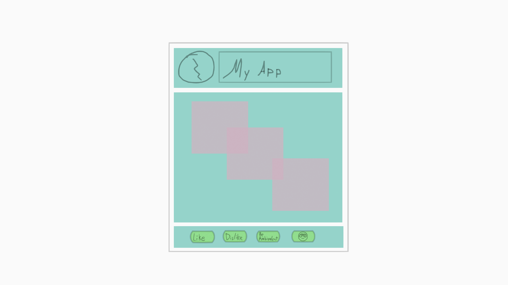

# Flutter

is an app development framework created by Google. It is relatively young; its version 1.0 was released in December 2018; but it's already in use for major mobile apps like Google Pay and eBay Motors. It's a cross-platform framework; you can make apps using Flutter and compile them to run on Windows, MacOS, Android, iOS, and apparently Google Fuschia, which is an operating system that I had never heard of. You can also compile for web browsers and put your app online; in my experience, Flutter web apps are a little slow and clunky because they exist in their own little world kind of like Flash games did, but it's still pretty convenient; like, you can put a demo version of your app online really easily, and then tell people that if they like it they should download the real version.

And I personally appreciate Flutter because it lets you create moden user interfaces without using the standard web languages of HTML, CSS, and JavaScript. In large part, I suspect, because web technologies are consistently portable to different platforms, most user interfaces today are created using those and then adapted into apps, a lot of the time just by taking a web browser and customizing it to not look like one. Like, even when you have Discord as an app on your computer, guess what, it's just a web page in disguise, you can see the HTML. It's the same for WhatsApp and Microsoft Teams and VSCode and a bunch of other apps.

HTML, CSS, and JavaScript have taken over the field of graphical user interfaces, which results in apps that are slow, because JavaScript is a slow language, and hard to program, because HTML, CSS, and JavaScript are old languages full of inexplicaple syntax for historical reasons that need lots of frameworks and libraries to try to make them modern and useable. Our subjects today will be the programming language called Dart and the user interface library written in it called Flutter, which offer a fully modern cross-platform alternative. (Whereas with web development, you will kind of need to augment your HTML/CSS/JavaScript with stuff like jQuery, React, Vue, Angular, Tailwind CSS, etc, etc.) So that's why you would learn to use this stuff. Let's start with some basics of the Dart programming language.

## Dart: It is normal

I'm assuming most of you have at least a little programming experience, for one thing because it's the end of the semester and taking CS1 is like bootcamp, and for another thing because the weather is warm now and if you were normal you'd be playing outside. We can run Dart code online by going to https://dartpad.dev. Let's look at the "Hello World" example they have there.

```dart
void main() {
  for (int i = 0; i < 5; i++) {
    print('hello ${i + 1}');
  }
}

```

It looks a lot like C++, right? You have a function called "main" that starts the program with a for loop in it; then a call to a print function inside the for loop, which is how you output to the console with Dart. Inside the call to the print function we have an example of string interpolation, which is how you combine string literals and variables in Dart but which we don't have to worry much about. Let's replace that with just `print('hello world');` (single quotes and double quotes are equivalent in Dart, both produce strings) and run it.

Wow, we just printed "hello world" 5 times. Good for us.

Now let's make things a little bit more interesting and define our own function above `main`. It will print two things. This is still a lot like C++:

```dart
void printEvent(String time, String event) {
  print("The "+event+" is at "+time);
}
```

So, we are declaring a function. The return type of the function is `void`, meaning it does not return anything. It has two parameters: a String parameter called event and another String parameter called time. In Dart, the built-in string class has a name that starts with a capital letter and you don't have to #include or use std:: to use it. And we are taking these two arguments and concatenating strings to get an output. Let's call this in `main`:

```dart
printEvent("7:00 PM", "meeting");
```

So, that's great. Functions are a thing in Dart.

### Named Parameters

But we can go one step further with this than we could with C++. The problem with this function is that you have to remember the order of the arguments; when you call it, you have to first put the time, then the event name; I could easily imagine someone mixing this up and doing:

```dart
printEvent("meeting", "7:00 PM");
```

And I don't think there's any obvious, conclusive, true order that the arguments should be in. To help with this, we can use named parameters. We can define a function like this:

```dart
void printEventNP({required String time, required String event}) {
  print("The "+event+" is at "+time);
}
```

So, the only difference is that I added NP to the name for "named parameters", then I wrapped the arguments in curly braces, then I had to add to word "required" in front of the argument type because for whatever reason, by default they're considered "optional", which we won't go into right now. The advantage of named parameters over the normal kind (the normal kind are called "positional") is that now we can call the function like this:

```dart
printEventNP(event: "meeting", time: "7:00 PM");
```

So now we don't have to worry about what order we're giving the arguments in; we just have to give them names. This style of calling functions is, in my opinion, more readable than just doing it based on the order of the arguments, and it's used by functions in the Flutter library a lot.

### Classes & Named Constructors

And another thing that the Flutter library uses a lot is classes and objects. I'm guessing that you know that an object is a programming language construct that groups together some variables and the functions that should operate on those variables, and that many different versions or instances of objects can be made that store different data in their copies of those variables, and that objects, in most languages, come from classes, which are like blueprints for objects that show what variables and what functions they should contain. Everyone knows this. So, for example, if you have a Mouse class, you can use it to make objects with data that represents specific mice, and obviously for each mouse you're going to want to store a first and last name. So let's make a Mouse class:

```dart
class Mouse {
    String _first;
    String _last;
}
```

So, objects that are based on this mouse class will all have a variable for a first name and a variable for a last name. Now, we have to add a constructor that will set those variables when an object is created. In Dart, this can be very simple.

```dart
class Mouse {
    String _first;
    String _last;
    Mouse(this._first, this._last);
}
```

This declares a constructor that has two parameters. The first will be automatically stored in the `_first` variable in the object we're creating; the second will automatically be stored in the `_last` variable. Note how `this` always refers to the specific set of variables associated with a specific object that is currently in use. Now we can call the constructor in our main function:

```dart
Mouse hatsune = Mouse("hatsune", "squeaku");
```

In Dart, like in most languages that aren't C++, you always call the constructor explicitly like it's a normal function that returns a value, instead of making it part of the variable declaration like in C++. So, this creates a mouse variable. Let's give ourselves the ability to print it out by adding a `toString` member function to it:

```dart
class Mouse {
    String _first;
    String _last;
    Mouse(this._first, this._last);
    String toString() { return _first + "🐭" + _last; }
}
```

Now, in our main, we can print it:

```dart
print(hatsune);
```

So yeah. That's relatively simple. We're going to learn another interesting Dart feature that we can use in our Flutter project. This feature is known as named constructors. In most languages, constructors, unlike other functions, do not have names; constructors can be overloaded to accept different argument lists, but you pretty much have to figure out when you should use each constructor overload on your own. In Dart, constructors can have names that explain their purpose, just like normal functions. They look like this:

```dart
class Mouse {
    String _first;
    String _last;
    Mouse(this._first, this._last);
    Mouse.disneyStyleLastName(this._first): _last = "Mouse";
    String toString() { return _first + "🐭" + _last; }
}
```

So, we're creating a constructor called `defaultLastName` that takes only one argument, which gets automatically stored in `_first`. We're then using an initializer list, which is pretty much the same as in C++ except it actually uses the assignment operator instead of having a weird parentheses situation, to set `_last` to a value that's going to be the same every time this constructor is called. This is how you call a named constructor:

```dart
Mouse mickey = Mouse.disneyStyleLastName("Mickey");
print(mickey);
```

So there you go.

Finally, I want to go on one more wild tangent that's general to programming languages and especially, for some reason, to this kind of programming: GUI programming with a lot of interacting parts. That topic is the general idea of evaluation, substitution, and order of operations. I want to draw a distinction between three uses of functions: you can just, call them; you can use their return values and basically substitute those into an expression; and/or, you can use a function as a value that's being stored somewhere to be called later. This last form of a function is called a callback and we'll get to it later.

The print function is simple. You call it and it prints something. That's the first way you can use a function. We're learning a lot today.

The second way is to use a function's return value for something. This is surprisingly deep. For the sake of argument, let's say you had a mathematical equation to solve. Something like 2 + 3 * 5. The first thing you would do to get started on solving it would be to take the 3 * 5 and substitute the result of that operation in for it, getting 2 + 15.

That's also how I like to think about functions. You would do kind of the same if you were writing code, like `int result = 2 + multiply(3 * 5)`. When people start programming, people sometimes get nervous about doing things like that? They see things like `int result = multiply(3 * 5);` a lot, where the result of calling a function is directly stored in a variable, and they don't realize that they can use functions literally anywhere that, in this case, they could use the number 15. The return value of the function is just substituted right into where you call it.

You can do some interesting things with this. For one thing, let's look at our class. Let's add one more field and one more function:

```dart
class Mouse {
    String _first;
    String _last;
    int squeaksEmitted = 0;

    Mouse(this._first, this._last);
    Mouse.disneyStyleLastName(this._first): _last = "Mouse";
    String toString() { return _first + "🐭" + _last; }
    void squeak() {
      print("squeak")
      squeaksEmitted += 1;
    }
}
```

Now we can have our mouse squeak:

```dart
mickey.squeak();
mickey.squeak();
mickey.squeak();
print(mickey.squeaksEmitted);
```

But this is kind of verbose. What if we make one simple change to our squeak function to make things easier?

```dart
Mouse squeak() {
  print("squeak");
  squeaksEmitted += 1;
  return this;
}
```

So, like I mentioned, `this` is a special keyword that refers to the object that the function was just called on, which in this case is `mickey`. Basically, if the function is called on Mickey (as in `mickey.squeak()`) it will then return `mickey`. (If it was called on `hatsune` it would return `hatsune`.) This lets us do this:

```dart
mickey.squeak().squeak().squeak();
print(mickey.squeaksEmitted);
```

To do the same thing.

This works because the call to `mickey.squeak()` is run and is replaced with what the return value is, which is `mickey`. So, the next `.squeak()` has `mickey` before it, so we're basically doing `mickey.squeak()` again. And you can continue this for as long as you want, or until "squeak" stops looking like a word anymore. That's called "chaining", and it's not Dart-specific, but is in fact in use in a couple of places; the first place I saw it was with the JavaScript library "sharp."

There's one more way to use this which is less in use:

```dart
Function squeak() {
  print("squeak");
  squeaksEmitted += 1;
  return squeak;
}
```

Now we're not just returning the current object, `mickey`, from the function; we're returning the `squeak` function itself. So when we call `mouse.squeak()`, it essentially gets replaced with its return value, which is `mouse.squeak`. Without the parentheses. So we can put the parentheses again. Getting `mouse.squeak()()`, which basically calls squeak twice. And so on and so on: `mouse.squeak()()()()()()...`

Now, some people would advise you to use, I don't know, loops to take some action over and over again in a concise fashion. (And Dart does have those.) But I feel like this usage is good when you don't really care enough to specify exactly how many times it happens. Like if you're making a game or a theme park attraction and you want a mouse to squeak, just, a whole bunch of times. So you slam some parentheses down.

This isn't language specific either, although I don't have an exhaustive list of languages this would work in. I would love to see someone acccomplish this in C++.

Anyway. Dart is a deep and complex language, and technically this code doesn't follow every possible best practice, which is why there are little blue lines in it in a few places. This DartPad editor is very opinionated about how exactly things should be done. But realistically, this is fine, and you don't have to learn Dart super deeply to use it. So, let's break out of the console and attempt to apply our partial knowledge to something more interactive.

## Flutter & Widgets

Go to https://hacksu.com/flutter to get this starting template:

```dart
// ignore_for_file: prefer_const_constructors, prefer_const_literals_to_create_immutables, annotate_overrides
import 'package:flutter/material.dart';

void main(){
  runApp(MaterialApp(home: ExampleApp()));
}


class ExampleApp extends StatelessWidget {
  Widget build(BuildContext context) {

  }
}
```

This is the basic, contentless template for a Flutter app. Don't worry too much about the details of it, since this is the kind of boilerplate that just gets copy/pasted, but: there is an import statement, which gives us access to code from the Flutter library. There is a main function, which calls `runApp()` from that library and gives it the named parameter "home" with an object of the class ExampleApp as the argument. There is a class called ExampleApp that extends and inherits from the Flutter class StatelessWidget and has a build function, which we will add to to create our app. And there is a comment up at the top that turns off compiler warnings that I disagree with.

The heart of any Flutter app is contained within its `build` functions. In the `build` functions, you have the ability to create and return a Widget. The class "Widget" is very important in Flutter. An object of that class is responsible for providing the content for a rectangular region of the screen. It either has content of its own, like an image or some text, or it has children that have content. A Widget that does not itself store text or an image or something like that will store other Widgets that do have that content, and will do something useful like positioning them, or adding a background or an outline to them, or only displaying them if some condition is met. Or something like that.

Every app starts off with at least a couple of widgets that don't really have content of their own, but that receive children that do. The first thing we're going to do is create an object of the class Scaffold:

```dart
Widget build(BuildContext context) {
    Widget scaffold = Scaffold(

    );

    return scaffold;
}
```

So, we're declaring a variable with the type "Widget." The type "Widget" is a broad type that means the variable can store many different things that all, as Widgets, represent the content of a region of the screen. Specifically, we're storing a Scaffold object in our Widget variable. A scaffold is like some sort of a frame that you can hang things on. In other words, it's one of those widgets that has no content of its own. We need one more step:

```dart
Widget build(BuildContext context) {
    Widget scaffold = Scaffold(
      body: Text("Hello World")
    );

    return scaffold;
}
```

And there we have it: an app, with some content. Text is a type of Widget (it's a derived class of Widget) that actually has content, so now our Scaffold has something to display.

### Wrapping Widgets in Widgets

The problem is that it's up in the corner, which is an awkward place for it. To fix this, we need to bring in yet another contentless Widget. If we simply make a Center widget and give it our Text widget to display, the Center widget will take up as much space as possible and display our Text at the center of that. This is where we can use a fun feature that this editor has, which is automatic code editing. Click on the word "Text" in the code so that the blinking cursor is positioned in it. Then, use the keyboard shortcut Alt+Enter. You will then have the option to automatically put the Text widget in a Center widget for positioning.

```dart
Widget scaffold = Scaffold(
    body: Center(child: Text("Hello World"))
  );
```

So, now the Text widget is passed to a new "Center" widget; Center widgets do not have any content, but display whatever widget is given to them as a child in the Center of whatever area they're in. And now when we run the app, we'll have the text in the center. And there's one more thing we can do to make this page look less dumb, which is to use a named parameter of the Text constructor to make the text larger. If you like, go to a function call and start to add a named parameter and press Ctrl-Space, you will see some suggestions for parameters you can add, which is helpful. We want the one called `textScaleFactor`.

```dart
Widget scaffold = Scaffold(
  body: Center(child: Text("Hello World!", textScaleFactor: 3))
);
```

So, this is roughly the most basic possible Flutter app. I'm going to add to it by adding another named parameter to the Scaffold constructor.

```dart
Widget scaffold = Scaffold(
  body: Center(child: Text("Hello World!", textScaleFactor: 3))
  appBar: AppBar(title: Text("This is my app :3")),
);
```

So like I said, Flutter apps are based on the \~principles of Material Design~, which means that they come with a whole bunch of built-in ideas about how apps should be structured. That's why they have all these particular template-like things, like Scaffold, which has a built in argument for a title thing at the top of your page. Another thing that I see getting actually used more often is the navigation drawer.

```dart
// this is added to the Scaffold() constructor below appBar
drawer: Drawer()
```

This is more of an actual thing. Drawer is another Widget that doesn't really have content, so we have to give it some. Generally, the child of a Drawer widget will be a ListView. ListView widgets let you view lists. A ListView will have an array of children, meaning that it will display multiple child Widgets:

```dart
drawer: Drawer(
    child: ListView(
        children: [

        ]
    )
)
```

Like in many dynamic languages, the way you create an array (technically, a list) in Dart is just by putting square brackets and then writing the contents of the list within them, with the items separated by commas. We'll start by putting one item in this array of children:

```dart
drawer: Drawer(
    child: ListView(
        children: [
            Text("Menu", textScaleFactor: 2)
        ]
    )
)
```

So yeah. There it is.

Let's say we were unhappy with how the word Menu is wedged into the top left of this drawer that we've created. One easy way to fix that is to make it the child of a Padding widget; Padding widgets display their children but add space ("padding") around them.. Like before, we can click on the Text and press Alt-Enter to bring up the option to get the Text inside another widget.

```dart
children: [
    Padding(
        padding: const EdgeInsets.all(8.0),
        child: Text("Menu", textScaleFactor: 2),
    )
]
```

The Padding constructor takes two arguments. One of them is the child Widget that it's going to display. The other is an object that stores the amount of space the child Widget should have around it on the left side, the right side, the top, and the bottom. The class for this kind of object is EdgeInsets, since it stores how far the child will be inset from the edge. The const keyword is an optional thing that declares values that can be fully computed and created in advance at compile time which is an optimization thing that we don't need to go into.

EdgeInsets.all is a named constructor! Like I said, objects of the EdgeInsets class store different inset distances for the left, top, right, and bottom sides of the widgets they're used by. However, in this code, the named constructor EdgeInsets.all will set the insets around all the edges to be 8.0 pixels. (You can use a floating point number here, but you don't have to.) If you want different amounts of padding on different sides of the text widget, you could use a different named constructor, like EdgeInsets.symmetric, which lets you set a different horizontal and vertical padding:

```dart
padding: const EdgeInsets.symmetric(horizontal: 8, vertical: 16)
```

So that's fun. Named constructors are a useful thing. They make it pretty clear what the object you're constructing will store no matter how many input arguments you're going to use.

### State Changes

So now that we have a menu, in a drawer, and generally with such a menu in such a drawer you'll want to be able to click on things in it and select a new page to look at. We can do that, but there's a complication. Right now, what we have is a StatelessWidget. We have written a class that extends the StatelessWidget class, and StatelessWidgets do not have a way to store data and trigger updates to the screen when it changes. Like, we could add a member variable to this class, but changing it would not do anything. To create a Widget that can cause itself to be rebuilt and re-drawn, we need a StatefulWidget.

Unfortunately, we can't just change "Stateless" to "Stateful" and call it a day. To create a Widget that can store data (its "state") and update the screen, we actually need two classes: one class that extends StatefulWidget, which will be practically empty, and one class that extends Flutter's "State" class, which will store data and have the build function and do all the actual work. I have looked at various explanations for why you need two classes to store data and update the screen and none of them make any sense. Fortunately, we have access to a code action that makes it easy to code this weird setup. If we click on StatelessWidget in the editor, press Alt-Enter, and choose "Convert to StatefulWidget", we will get the two classes we need: one that does nothing and one that gets the build method. So now we have that, and our code should still work just like before.

The whole file at this point:

```dart
// ignore_for_file: prefer_const_constructors, prefer_const_literals_to_create_immutables, annotate_overrides
import 'package:flutter/material.dart';

void main() {
  runApp(MaterialApp(home: ExampleApp()));
}

class ExampleApp extends StatefulWidget {
  @override
  State<ExampleApp> createState() => _ExampleAppState();
}

class _ExampleAppState extends State<ExampleApp> {
  Widget build(BuildContext context) {
    Widget scaffold = Scaffold(
      body: Center(child: Text("Hello World!", textScaleFactor: 3)),
      appBar: AppBar(title: Text("This is my app :3")),
      drawer: Drawer(
        child: ListView(
          children: [
            Padding(
              padding: const EdgeInsets.symmetric(horizontal: 8, vertical: 16),
              child: Text("Menu", textScaleFactor: 2),
            )
          ]
        )
      )
    );

    return scaffold;
  }
}
```

So, now that we have our useful class and our useless class, let's store some data in the useful one. We can add a String variable called currentPage and make it default to "Home":

```dart
class _ExampleAppState extends State<ExampleApp> {
    String currentPage = "Home";
```

Now we can use it to determine what should be the argument for the `body` named parameter in our `Scaffold` object. To do that, let's extract the thing we're currently using for that into a variable:

```dart
Widget build(BuildContext context) {
    Widget appBody = Center(child: Text("Hello World!", textScaleFactor: 3));

    Widget scaffold = Scaffold(
        body: appBody,
        appBar: AppBar(title: Text("This is my app :3")),
        drawer: Drawer(
            child: ListView(
                children: [
                    Padding(
                        padding: const EdgeInsets.symmetric(horizontal: 8, vertical: 16),
                        child: Text("Menu", textScaleFactor: 2),
                    )
                ]
            )
        )
    );

    return app;
  }
```

Then, if we want to, we can reassign this variable based on the value of `currentPage` before we create our app:

```dart
Widget appBody = Center(child: Text("Hello World!", textScaleFactor: 3));
if (currentPage = "Horse") {
    appBody = Image.network("https://mitch.website/horse.jpg");
}
```

We can test this out by manually changing the default value of the `currentPage` variable to "Horse". But probably we want the user to be able to make this change.

To do this, we're going to add some options to the Drawer menu. Underneath our padded title in the ListView in our Drawer, let's add a couple of ListTile widgets, which is a lot like a Text widget, but has some extra features that we're going to use.

```dart
children: [
  Padding(
    padding: const EdgeInsets.symmetric(horizontal: 8, vertical: 16),
    child: Text("Menu", textScaleFactor: 2),
  ),
  ListTile(
    title: Text("Home")
  ),
  ListTile(
    title: Text("Horse")
  ),
]
```

This is a very sensible menu. We can now use the onTap named parameter of the ListTile constructor to give it a function to run when someone clicks or taps on it.

This is going to be a little bit tricky, since we have multiple layers of functions to run. First, we want to create an event listener function, which is the one that will be called directly when someone clicks or taps on a ListTile. In Dart, functions usually have the fairly standard syntax where you put the return type of the function, then its name, then its argument list in parentheses, then the function body in curly braces. It turns out that in some contexts, you can leave out the first two of those things:

```dart
ListTile(
  title: Text("Home"),
  onTap: (){

  }
),
```

Although it does nothing, since the function body is empty, this is a real live function in Dart; we don't have to give it a name or a return type. The name is unnecessary since we won't be writing our own code that calls this function, and the return type is inferred from the fact that event listener functions only do stuff; they return nothing. (If we did try to return something from an event listener function like this, we'd get an error.) In that function, we need to create another function. In this function, we will call `setState`, which is a function that will update the variables of our State class and trigger the user interface to be re-drawn.

```dart
ListTile(
  title: Text("Home"),
  onTap: (){
    setState();
  }
),
```

And as an argument to setState, we need to pass a mutator function, which will do the actual changing of the variables that I just mentioned. So, we need another anonymous callback function, inside our function call, inside our event listener callback function.

It's pretty easy, though. It'll just set the currentPage variable to the value "Home":

```dart
 ListTile(
  title: Text("Home"),
  onTap: (){
    setState((){
      currentPage = "Home";
    });
  }
)
```

So, there you go, I hope you like open and close brackets. Let's do the same thing in the other ListTile with the String value "Horse". If you want, you can just copy and paste:

```dart
ListTile(
  title: Text("Home"),
  onTap: (){
    setState((){
      currentPage = "Home";
    });
  }
),
ListTile(
  title: Text("Horse"),
  onTap: (){
    setState((){
      currentPage = "Horse";
    });
  }
)
```

And look at that: clicking on our drawer items now does something.

The only annoying thing is that our drawer stays open even as the stuff in the background changes. To change that, we just need to add one line to each of our event listener functions, underneath our calls to setState:

```dart
ListTile(
  title: Text("Home"),
  onTap: (){
    setState((){
      currentPage = "Home";
    });
    Navigator.pop(context);
  }
),
ListTile(
  title: Text("Horse"),
  onTap: (){
    setState((){
      currentPage = "Horse";
    });
    Navigator.pop(context);
  }
)
```

We're not going to get into it, but in Flutter, there's the concept of a navigation stack that's stored in the current BuildContext, where when you do something like clicking on the drawer button at the top left of your app, you push an item onto it, and when you call .pop(), you then obviously pop the most recently pushed item off of it. Alternatively, don't worry about it, this is a magic drawer-closing function.

So, this is where I leave you, with an extremely normal app that will no doubt become the next Uber. Believe it or not, this is pretty much the basic pattern of Flutter development; you alternate Widgets that arrange content, like Center and ListView, with Widgets that display content, like Image and Text. I made this gif that illustrates a couple other layout widgets and how they arrange stuff:



So, yeah, there are rows and columns, and stacks that let you put widgets wherever and on top of each other. Fun.

## Running Flutter Apps Locally

The Flutter SDK is available for download here: https://docs.flutter.dev/get-started/install

Once you download and install it, you should get access to many command line tools. You should be able to open a terminal window and enter `flutter create my_example` and get a new folder called "my_example" that has all the files necessary for a Flutter app in it. It might take a while, because Flutter will add the files necessary to compile your app for any platform: you'll get folders for Windows, MacOS, iOS, Android, et cetera. The only one that you need to modify is the "lib" folder; it will have a folder called main.dart that you can paste all your code from DartPad into.

Then, we can go to the main project folder in the terminal and run our program with `flutter run`. Running a Flutter program in debug mode on your computer has advantages over using DartPad; for one thing, you can divide your code into more than one file, and for another, when you change code, the app will automatically reload much faster (even though the initial compilation takes a while).

If you have an Android phone with developer mode and USB debugging turned on, it's also pretty easy to connect your device to your computer via USB, find it by running `flutter devices` in the terminal, and then run your app on your phone with `flutter run -d [your device's name]`. It's very convenient.


